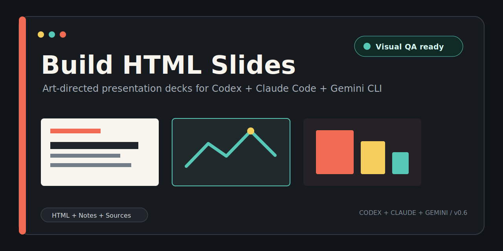
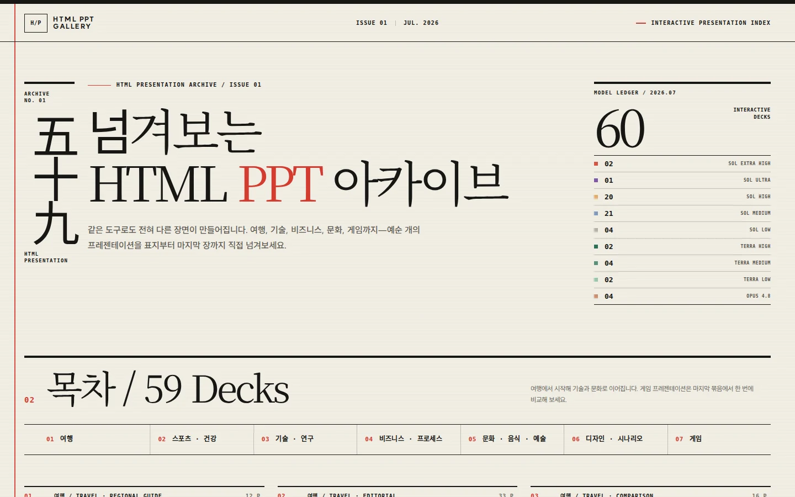
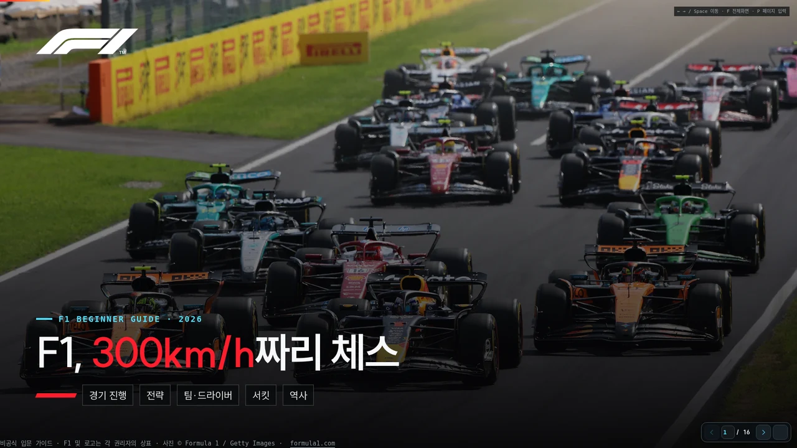
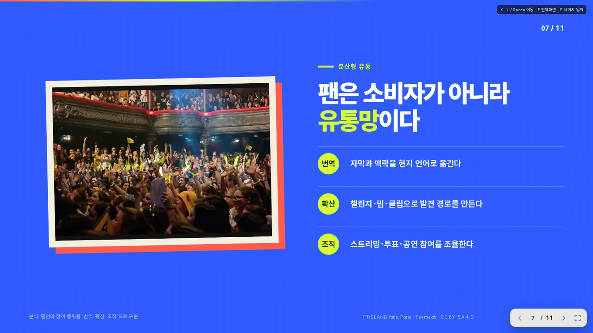
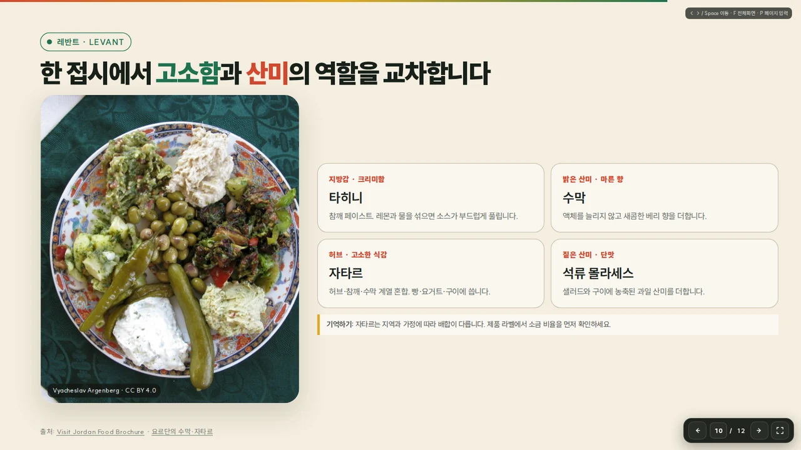
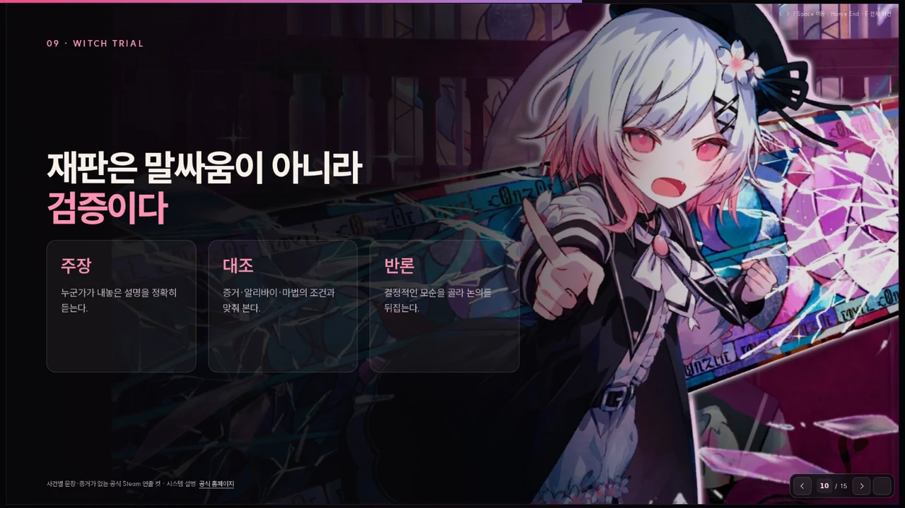
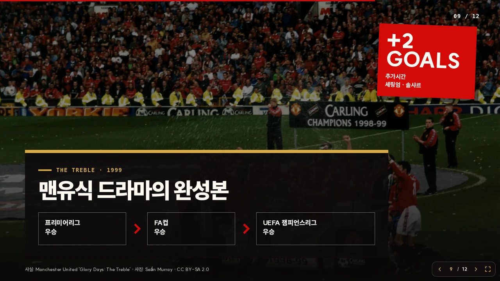
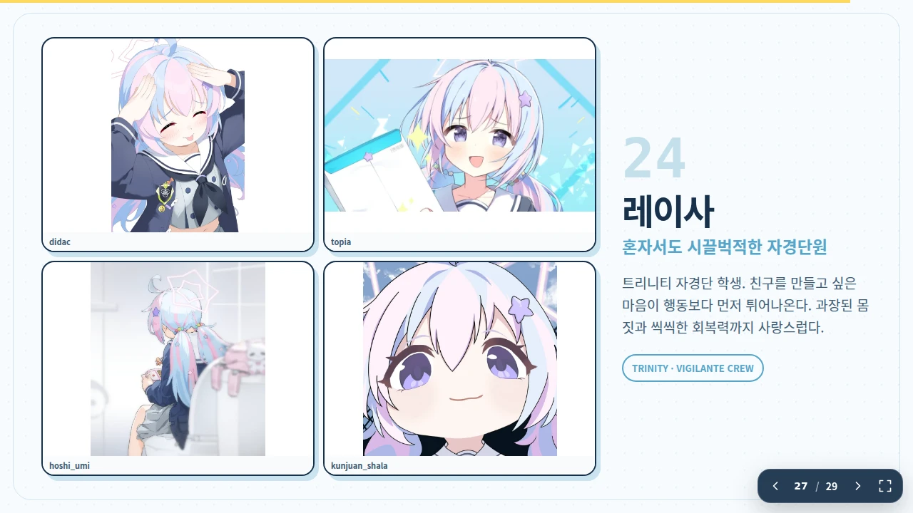
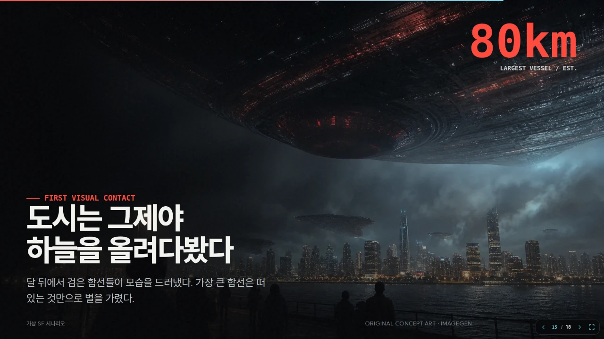

<p align="center">
  
</p>

<p align="center">
  <a href="https://github.com/mclub4/build-html-ppt/releases"></a>
  <a href="LICENSE"></a>
  
</p>

<p align="center">
  <strong>한국어</strong> · <a href="README.en.md">English</a> · <a href="README.ja.md">日本語</a>
</p>

<h1 align="center">Build HTML Slides</h1>

<p align="center">
  Codex, Claude Code, Gemini CLI가 발표의 대상과 목적을 먼저 읽고, 보기 좋은 HTML 슬라이드와 발표 노트까지 완성하도록 만든 프레젠테이션 스킬입니다.
</p>

<h2 align="center">
  <a href="https://html-ppt-gallery.unequaled-condor.workers.dev/">HTML PPT 작품 갤러리에서 실제 결과 보기</a>
</h2>

<p align="center">
  <a href="https://html-ppt-gallery.unequaled-condor.workers.dev/">
    
  </a>
</p>

<p align="center">
  <strong>갤러리의 발표 자료는 모두 Build HTML Slides로 뽑은 실제 작품 예시입니다.</strong>
</p>

> **OpenAI Codex CLI / Codex App, Anthropic Claude Code, Google Gemini CLI를 지원**합니다. 이 저장소는 커뮤니티 프로젝트이며 각 플랫폼 제공사의 공식 프로젝트가 아닙니다.

## 현재 상태

HTML 기반 PPT 제작 스킬을 시험 운영 중입니다. HTML로 만든 발표자료는 AI가 슬라이드 구조와 개별 요소를 직접 살펴볼 수 있어, 내용과 배치, 디자인을 세밀하게 수정하기 좋습니다. 사용자의 요구도 구체적으로 반영할 수 있습니다.

아직 테스트 단계라 데스크톱 발표 환경을 우선합니다. 모바일 대응을 요청해 별도로 검증한 발표자료가 아니라면 작은 화면에서 일부 요소가 제대로 표시되지 않을 수 있습니다.

제작 모드는 두 가지입니다.

- **빠른 검증 모드(Quick Draft)**: 이야기 구조와 디자인을 빠르게 완성해 바로 전달합니다. 이름과 달리 별도의 렌더링 검증은 실행하지 않으며, 브라우저 렌더링, 자동 검사, AI 시각 검토, 품질 점수 계산을 생략합니다.
- **정밀 검증 모드(Full Validation)**: 모든 슬라이드를 렌더링하고 구성, 내용, 배치, 이미지를 세밀하게 살펴 보완합니다.

약 15장 분량을 기준으로 빠른 검증에는 약 10분, 정밀 검증에는 약 1시간이 걸립니다. **Codex GPT-5.6, 추론 강도 Medium**을 기준으로 잡은 대략적인 목표입니다. 실제 시간은 주제 조사와 이미지 탐색량, 선택한 모델, 실행 환경에 따라 달라집니다. Quick Draft 결과에는 렌더링이나 검증 근거가 없습니다. 필요하면 같은 발표자료를 나중에 Full Validation으로 검증할 수 있습니다. 20~25장 정밀 검증은 40~90분 안에 마치는 것을 목표로 합니다. 팬아트나 이미지를 대량으로 찾느라 90분을 넘길 것으로 예상되면, 현재 후보를 확정할지 탐색을 이어갈지 사용자에게 확인합니다.

## 실제 생성 예시

아래 이미지는 이 스킬로 만든 HTML 프레젠테이션을 Chromium에서 직접 렌더링한 결과입니다. 홍보용 키 비주얼, 여행·음식 에디토리얼, 스포츠 데이터, 기술 시스템 흐름처럼 발표 주제에 따라 구성을 달리했습니다. 각 이미지는 전체 PPT에서 일부 슬라이드만 골라 소개합니다.

<table>
  <tr>
    <td width="33.33%">
      
      <br /><strong>게임 문화 · 팬 생태계</strong>
    </td>
    <td width="33.33%">
      
      <br /><strong>스포츠 입문 · 레이스 가이드</strong>
    </td>
    <td width="33.33%">
      
      <br /><strong>문화 산업 · 팬덤 흐름</strong>
    </td>
  </tr>
  <tr>
    <td width="33.33%">
      
      <br /><strong>음식 에디토리얼 · 역할 비교</strong>
    </td>
    <td width="33.33%">
      
      <br /><strong>아이돌 홍보 · 캐릭터 스토리</strong>
    </td>
    <td width="33.33%">
      
      <br /><strong>게임 홍보 · 키 비주얼</strong>
    </td>
  </tr>
  <tr>
    <td width="33.33%">
      
      <br /><strong>여행 가이드 · 목적지 정보</strong>
    </td>
    <td width="33.33%">
      
      <br /><strong>기술 설계 · 우주 현장</strong>
    </td>
    <td width="33.33%">
      
      <br /><strong>스포츠 홍보 · 클럽 서사</strong>
    </td>
  </tr>
  <tr>
    <td width="33.33%">
      
      <br /><strong>게임 캐릭터 · 팬아트 큐레이션</strong>
    </td>
    <td width="33.33%">
      
      <br /><strong>제품 홍보 · 게임 경험</strong>
    </td>
    <td width="33.33%">
      
      <br /><strong>SF 시나리오 · 침공 서사</strong>
    </td>
  </tr>
</table>

게임명, 로고, 캐릭터 및 기타 제3자 자료의 권리는 각 권리자에게 있습니다. 예시 이미지는 스킬의 출력 형식과 디자인 범위를 설명하기 위해 사용합니다.

## 무엇을 만드나요?

한 번 요청하면 다음 결과물을 함께 만듭니다.

- 오프라인에서도 열리는 단일 HTML 프레젠테이션
- 슬라이드별 발표 노트 Markdown
- 이미지 URL, 해시, 확인일을 보관하는 `sources.json`
- 키보드, 클릭, 페이지 번호 입력, 전체 화면을 지원하는 발표용 내비게이션
- 인쇄, 짧은 화면, 확대 환경을 고려한 반응형 무대

내용을 카드에 나누어 담는 단순한 템플릿이 아닙니다. 발표 대상과 의사결정자, 배경지식, 예상 반론을 살핀 뒤 이야기 순서를 정하고 주제에 맞는 테마와 시각 자료를 고릅니다.

## 발표자 노트 예시

HTML과 함께 만드는 `OUTPUT-notes.md`에는 슬라이드별 목적, 발표할 때 바로 읽을 수 있는 멘트, 강조점, 다음 장으로 이어지는 문장을 담습니다. 근거가 필요한 내용에는 출처와 주의사항도 남깁니다.

> **10. 자율 판단 루프**
>
> **목적:** AI를 통제되지 않은 대장으로 두지 않고 정책 가드레일 안의 판단 도구로 배치한다.
>
> **발표 멘트:** “관측, 예측, 결정, 실행, 학습이 반복되지만 전부 권한과 금지 규칙 안에서 움직입니다. 기계는 빠른 계산과 반복 복구를 맡고, 생명 위험과 비가역 조치는 사람이 결정합니다.”
>
> **전환:** “이제 실제로 펌프가 멈췄다고 가정해 보겠습니다.”

## 주요 기능

| 영역 | 지원 내용 |
| --- | --- |
| 스토리 | 임원, 사업, 개발, 고객, 투자자 등 청중에 맞춘 정보 순서와 깊이 |
| 디자인 추론 | 12개 주제 계열의 증거 규칙, 10개 발표 목적, 청중을 조합하고 밀도·실사진 필요도·시각적 모험성·모션을 조절해 서로 다른 후보 3개를 비교 |
| 디자인 | 1페이지 표지를 최우선 아트 디렉션 대상으로 설계하고, 언어·주제에 맞춘 디스플레이/본문 글꼴, 공식 브랜드 자산, WebP 이미지, 열린 레이아웃, 다이어그램 적용 |
| 이미지 안전성 | 키 비주얼 잘림 방지, 왜곡 탐지, 저해상도 경고, 출처·해시 캐시, 캐릭터/인물 기준 이미지 대조 |
| 발표 경험 | 애니메이션, 직접 페이지 이동, 전체 화면, 키보드와 클릭 내비게이션 |
| 검증 | 텍스트 이탈, 컨트롤, 이미지 geometry와 `PLACE NOTE` 같은 미완성 플레이스홀더를 자동 차단한 뒤 내용 적합성·자산 완성도·캐릭터 동일성을 포함한 AI 시각 검토 |
| 최종 위계 검토 | 기존 캡처로 축소·약한 블러 contact sheet를 한 장 만들어 초점, 강약, 리듬, 색·밀도 균형만 저렴하게 추가 점검 |
| 수정 속도 | 문구·이미지·슬라이드 전용 CSS는 수정된 장만, 순서·전환·인접 선택자 변경은 앞뒤 장까지, 공통 CSS·런타임 변경은 전체를 재검증 |

산업, 제품, 시설, 장비, 생명과학·의학 연구처럼 실물을 봐야 이해하기 쉬운 주제는 표와 SVG만으로 설명하지 않습니다. 기업·기관의 공식 이미지, 제품·시설 사진, 현미경·병리·의료 영상 등 알맞은 시각 자료를 데이터와 다이어그램에 곁들입니다. 추상 개념이나 기밀 시스템처럼 사진이 설명에 보탬이 되지 않는 슬라이드에는 이미지를 억지로 넣지 않습니다.

주제 계열은 색상이나 글꼴을 고정하지 않고 필요한 근거만 정합니다. 반도체라면 실제 장비·시설·공정을, 의료 연구라면 실제 연구·임상 이미지와 불확실성을, 여행이라면 실제 장소·지도·시간·위치를 우선합니다. AI는 문맥을 읽고 주제 계열과 발표 목적을 고른 다음 구조화된 후보 검색기를 호출합니다. 제목에 `기술`, `AI`, `MSA`가 들어갔다는 이유만으로 어두운 콘솔 테마를 택하지 않습니다.

정밀 검증 마지막에는 squint review를 진행합니다. 전체 슬라이드를 작게 줄이고 약한 블러를 적용해, 세부 글자 대신 시각적 위계만 살피는 검사입니다. 글자 겹침이나 어색한 줄바꿈, 이미지 잘림·왜곡·내용 적합성은 이 방식으로 판단할 수 없어 기존 전체 크기 검토를 대신하지 않습니다. 이미 만든 `normal` 캡처를 재사용하므로 슬라이드를 다시 렌더링하지 않습니다.

## 이미지 생성 도구

이미지 생성은 선택 사항입니다. Codex App에서 ImageGen을 제공하거나 Claude Code·Gemini CLI에 호환 도구가 연결되어 있다면 분위기 이미지, 에디토리얼 일러스트, 개념 장면, 배경을 만드는 데 활용합니다. 플랫폼 이름만 보고 생성기가 있다고 가정하지 않으며, 현재 세션에 연결된 도구부터 확인합니다.

실존 인물·그룹, 출시된 게임과 제품, 실제 장소·행사·인터페이스·연구 결과를 소개할 때는 공식 사진, 실제 스크린샷, 키 아트, 패키지, 기록 이미지처럼 출처가 있는 자료를 먼저 찾습니다. ImageGen은 분위기 배경, 추상 개념, 가상 시나리오, 장식에만 씁니다. 실제 대상을 대신하는 닮은꼴 이미지나 가짜 스크린샷은 만들지 않습니다. 이미 존재하는 대상을 다루는 표지에도 그 대상을 알아볼 수 있는 출처 기반 이미지가 최소 하나 필요합니다.

**Claude Code 기본 설치에는 래스터 이미지 생성기가 포함되지 않습니다.** 렌더링된 이미지를 읽고 검토하는 기능과 새 이미지를 생성하는 기능은 별개입니다. Claude Code에서 생성 배경·일러스트·콘셉트 아트를 사용하려면 호환되는 이미지 생성 플러그인, MCP 서버 또는 외부 도구를 별도로 연결해야 합니다.

Gemini CLI에서도 현재 세션에 연결된 도구·확장 기능을 먼저 확인합니다. 생성기가 없으면 공식·사용자 제공·웹 조사 이미지와 HTML/CSS/SVG로 계속 작업하며, 생성 도구·인증 정보·유료 서비스를 추가하기 전에는 반드시 사용자 동의를 받습니다.

생성 도구가 없어도 작업은 이어집니다. 공식 이미지, 사용자가 제공한 자료, 라이선스를 확인한 이미지, 웹에서 찾은 자료와 HTML/CSS/SVG 다이어그램을 활용하며 브라우저 사전 검사도 실패로 처리하지 않습니다. 사용자가 생성 이미지를 분명히 요청했는데 도구가 없다면, 도구나 인증 정보, 유료 서비스를 임의로 설치하지 않습니다. 기존 이미지로 진행할지 생성 도구를 추가할지 먼저 확인합니다.

## 설치 전 준비

필수 도구:

- [OpenAI Codex CLI](https://developers.openai.com/codex/cli/), [Anthropic Claude Code](https://code.claude.com/docs/en/overview), 또는 [Google Gemini CLI](https://github.com/google-gemini/gemini-cli) 최신 버전
- Python 3.10 이상
- Node.js 18 이상
- Playwright와 Chromium은 Full Validation을 실행할 때만 필요

Codex CLI가 없다면 macOS/Linux/WSL에서 다음 공식 설치 명령을 사용할 수 있습니다.

```bash
curl -fsSL https://chatgpt.com/codex/install.sh | sh
```

Claude Code 설치는 공식 문서를 따르세요. 설치 후 `claude --version`으로 확인할 수 있습니다.

Gemini CLI 설치는 공식 저장소 안내를 따르세요. 설치 후 `gemini --version`으로 확인할 수 있습니다.

저장소를 클론해 개발하거나 테스트할 때는 루트에서 렌더링 의존성을 설치합니다.

```bash
npm install
npx playwright install chromium
```

Linux/WSL에서 Chromium 시스템 라이브러리까지 필요하면 다음을 사용합니다.

```bash
npx playwright install --with-deps chromium
```

설치 확인:

```bash
npm run check:browser
```

플러그인 또는 단독 스킬 ZIP만 설치한 환경에는 루트 `package.json`이 없어도 됩니다. Quick Draft는 브라우저 도구를 검사하거나 설치하지 않습니다. Full Validation을 선택한 경우에만 해당 스킬의 `scripts/check_environment.py`를 실행하고, Playwright/Chromium이 없다는 결과가 나온 뒤 사용자가 설치에 동의한 경우에만 다음 관리형 설치 도구를 실행합니다.

```bash
python3 <설치된-build-html-slides-스킬>/scripts/install_browser_dependencies.py --consent
```

이 도구는 계약에 고정된 Playwright와 Chromium을 `~/.build-html-slides/runtime`에 설치합니다. Linux 시스템 라이브러리도 필요하면 별도 동의를 받은 뒤 `--with-deps`를 추가합니다. 설치 도구는 `--consent`가 없으면 파일을 만들기 전에 종료합니다.

`Pillow`, `cwebp`, ImageMagick은 선택 사항입니다. PNG 메타데이터 검사 속도를 높이거나 외부 이미지를 WebP로 일괄 변환할 때 유용하지만 스킬 실행의 필수 조건은 아닙니다.

릴리스 ZIP 생성은 Python 표준 라이브러리를 사용하므로 별도의 `zip` 패키지가 필요하지 않습니다.

## 설치

각 플랫폼에서는 **플러그인과 단독 스킬 중 하나만** 선택하세요. 둘 다 설치하면 같은 스킬이 중복으로 표시될 수 있습니다.

### AI 에이전트에게 설치를 맡긴 경우

GitHub 저장소 링크를 받은 AI 에이전트가 설치했다면, 완료 안내에 다음 내용을 **반드시** 포함해야 합니다.

- [`epoko77-ai/im-not-ai`](https://github.com/epoko77-ai/im-not-ai)는 필수 의존성이 아닌 선택형 동반 스킬입니다. 이 저장소에 포함되거나 자동 설치되지 않으며, `humanize-korean`으로 사실·수치·고유명사·출처가 확정된 뒤 한국어 슬라이드 문구와 발표 노트를 자연스럽게 다듬을 수 있습니다. 별도로 설치한 뒤 Claude Code에서는 `/humanize-korean`, Codex에서는 `$humanize-korean`으로 실행하며 Codex는 Fast 단일 호출 모드를 사용합니다.
- 이 저장소는 Archify v2.12.0을 독립 스킬로 함께 제공합니다. 원본은 [`tt-a1i/archify`](https://github.com/tt-a1i/archify)이며, 아키텍처, 네트워크 토폴로지, 시퀀스, 워크플로, 라이프사이클과 복잡한 데이터 흐름을 자체 완결 HTML과 인라인 SVG로 만들고 조건에 맞는 슬라이드에서 자동 사용합니다.
- Claude Code를 설치했다면, 기본 Claude Code에는 래스터 이미지 생성기가 없다는 점을 알려야 합니다. 생성 이미지가 필요하면 호환되는 플러그인·MCP·외부 이미지 생성 도구를 별도로 구성해야 하며, 추가 설치나 인증 정보 설정 전에는 사용자 동의를 받아야 합니다.
- 생성기가 없어도 스킬은 동작하며 공식·제공·조사 이미지와 HTML/CSS/SVG 다이어그램을 사용한다는 점, 그리고 설치 후 새 세션이나 작업을 시작해야 한다는 점을 알려야 합니다.
- 설치 에이전트는 `humanize-korean`의 설치 여부만 확인합니다. 누락됐다면 `선택 도구인 im-not-ai(한국어 윤문)도 설치할까요?`라고 묻고, 동의 전에는 설치하지 않습니다. Archify는 이미 배포물에 포함되므로 별도 설치 여부를 묻지 않습니다.
- 사용 가능한 `humanize-korean`과 함께 제공된 `archify`는 각 적용 조건이 맞을 때 다시 허락을 묻지 않고 자동 사용합니다. 기존에 별도로 설치된 Archify가 있으면 `--force`를 명시하지 않는 한 덮어쓰지 않습니다.

이 안내는 플러그인과 단독 스킬 설치에 모두 적용됩니다. 선택 도구를 설치하지 않았다면 설치했다고 표현해서는 안 됩니다. 저장소의 [AGENTS.md](AGENTS.md)와 [CLAUDE.md](CLAUDE.md)에도 같은 계약이 정리되어 있습니다.

### 방법 A. Claude Code 플러그인

```bash
claude plugin marketplace add mclub4/build-html-ppt
claude plugin install build-html-slides@build-html-slides
```

설치 후 새 세션에서 자연어로 요청하거나 `/build-html-slides:build-html-slides`를 실행합니다. Claude 플러그인에는 독립 시각 검토자와 최종 품질 편집자 서브에이전트가 함께 포함됩니다.

### 방법 B. Codex 플러그인

```bash
codex plugin marketplace add mclub4/build-html-ppt
codex plugin add build-html-slides@build-html-slides
```

팀 배포, 버전 관리, Codex 플러그인 UI 사용에는 이 방법을 권장합니다.

### 방법 C. Gemini CLI Agent Skill

릴리스의 `.skill` 파일은 Gemini CLI가 직접 설치하는 ZIP 호환 패키지입니다. `SKILL.md`는 아카이브 루트에 있습니다.

```bash
gemini skills install ./BUILD-HTML-SLIDES-GEMINI-vX.Y.Z.skill
gemini skills install ./ARCHIFY-GEMINI-v2.12.0.skill
gemini skills list
```

워크스페이스 범위가 필요하면 Gemini CLI의 `--scope workspace` 옵션을 사용합니다. 스킬은 설명과 일치하는 자연어 요청에서 활성화 동의를 거쳐 로드됩니다.

### 방법 D. 저장소에서 단독 스킬 설치

```bash
git clone https://github.com/mclub4/build-html-ppt.git
cd build-html-ppt
./install.sh
```

기본 설치는 감지된 Claude Code, Codex, Gemini CLI에 각각 심링크를 연결합니다. 한 플랫폼에만 설치하려면 다음 옵션을 사용합니다.

```bash
./install.sh --claude-only
./install.sh --codex-only
./install.sh --gemini-only
```

각 플랫폼의 `skills/build-html-slides`와 `skills/archify`에 두 독립 스킬이 함께 설치됩니다. 저장소 없이 복사본을 유지하려면 `./install.sh --copy`를 함께 사용하세요. 기존에 이 저장소와 무관한 Archify가 있으면 보존하며, 교체는 `--force`를 명시한 경우에만 수행합니다.

```bash
./update.sh       # 최신 버전으로 업데이트
./uninstall.sh    # 이 저장소가 설치한 단독 스킬 제거
```

설치 후에는 새 Claude Code 세션, Codex 작업, 또는 Gemini CLI 세션을 시작해야 변경된 스킬을 안정적으로 불러옵니다.

## 사용법

자연어로 요청하거나 플랫폼별 스킬 이름을 직접 지정하면 됩니다.

Claude Code 플러그인:

```text
/build-html-slides:build-html-slides
사업팀, 개발팀, 대표님에게 신규 결제 인프라 전환안을 설명할 발표자료를 만들어줘.
```

Claude Code 단독 스킬은 `/build-html-slides`, Codex는 `$build-html-slides`를 사용합니다. Gemini CLI에서는 발표자료 제작을 자연어로 요청하면 Agent Skill 활성화 동의가 표시되며, `/skills list`와 `/skills reload`로 상태를 확인할 수 있습니다.

```text
$build-html-slides
사업팀, 개발팀, 대표님에게 신규 결제 인프라 전환안을 설명할 발표자료를 만들어줘.
의사결정이 필요한 내용은 앞에 두고, 구현 세부사항은 뒤에 배치해줘.
```

```text
이 HTML 발표자료에서 7번 슬라이드 이미지만 교체해줘.
수정된 슬라이드만 다시 렌더링해서 잘림과 비율을 꼼꼼히 검토해줘.
```

일반 수정은 새로운 검증 근거가 필요하지 않다면 빠른 **Edit Only**로 처리합니다. 새 발표자료를 만들 때 청중이나 모드가 빠져 있다면, 작업에 앞서 한 번의 질문으로 청중과 **빠른 검증(Quick Draft)**·**정밀 검증(Full Validation)** 중 사용할 모드를 함께 확인합니다. 청중을 알아서 정해 달라고 하면 도메인 지식 수준이 섞인 회사 전체 개념 공유용을 기본값으로 삼습니다.

빠른 검증(Quick Draft)은 HTML, 발표자 노트, `sources.json`, 자산을 만든 뒤 바로 전달합니다. 환경 검사, Chromium 렌더링, 자동 검증, AI 시각 검토, 품질 점수 계산은 하지 않습니다. 전달할 때는 렌더링 검증을 거치지 않은 결과라는 점을 밝힙니다.

정밀 검증(Full Validation)을 선택한 경우에만 환경 검사를 실행합니다.

```bash
python3 codex/skills/build-html-slides/scripts/check_environment.py
# Claude 배포본에서는 .claude/skills/build-html-slides/scripts/check_environment.py
```

Python, Node.js, Playwright 또는 Chromium이 없거나 버전이 맞지 않으면 누락 항목을 알리고 설치 여부를 묻습니다. 사용자가 동의하기 전에는 패키지를 설치하거나 시스템을 변경하지 않습니다.

동의한 뒤에는 설치된 스킬의 `scripts/install_browser_dependencies.py --consent`를 우선 사용하고 환경 검사를 다시 실행합니다. 시스템 라이브러리를 설치할 수 있는 `--with-deps`는 그 변경에도 동의한 경우에만 사용합니다.

Full Validation은 여러 스크립트를 따로 조합하지 않고 하나의 진입점으로 실행합니다. 20~25장이라면 보통 40~90분 안에 마치는 것을 목표로 합니다. 이미지 탐색 때문에 더 오래 걸릴 것으로 예상되면, 현재 후보를 확정할지 탐색을 이어갈지 먼저 확인합니다.

```bash
python3 codex/skills/build-html-slides/scripts/validate_all.py OUTPUT.html --mode full --review-risk standard --phase prepare
python3 codex/skills/build-html-slides/scripts/validate_all.py OUTPUT.html --phase verify
python3 codex/skills/build-html-slides/scripts/validate_all.py OUTPUT.html --phase finalize-prepare
python3 codex/skills/build-html-slides/scripts/validate_all.py OUTPUT.html --phase finalize-verify
```

증분 수정의 `--change-type`은 최적화를 돕는 힌트입니다. 실제 지문을 기준으로 문구·이미지·슬라이드 전용 CSS는 영향을 받은 장만 다시 렌더링합니다. 구조·순서·전환처럼 주변 맥락이 달라지면 앞뒤 장까지, 공통 CSS·런타임이 바뀌면 전체를 확인합니다. 수정 중 `verify`는 새 캡처만 픽셀 단위로 검사하고, 최종 확정 때 전체 근거를 한 번 대조합니다. 실패가 발생하면 해당 슬라이드와 검사 항목에 집중합니다. 캡처 해시가 그대로인 독립 교차 검토 결과는 보존합니다. 최종 교차 검토 대상은 표지와 마무리, 핵심 구조, 자동 경고, 인물·캐릭터 동일성 확인이 필요한 슬라이드로 제한합니다. 고위험 검증도 일반 슬라이드 전체를 다시 보지 않습니다.

## 작업 파일 위치

최종 프레젠테이션 폴더에는 HTML, 발표자 노트, `sources.json`, 실제 사용 자산만 남깁니다. 렌더 캡처, 검토 매니페스트, 문구 초안, 접촉 시트 같은 작업 파일은 발표자료별로 다음 경로에 모입니다.

```text
~/.codex/build-html-slides/workspaces/<자료이름>-<경로해시>/   # Codex
~/.claude/build-html-slides/workspaces/<자료이름>-<경로해시>/  # Claude Code
~/.gemini/build-html-slides/workspaces/<자료이름>-<경로해시>/ # Gemini CLI
├── review/   # Chromium 캡처와 검토 매니페스트
├── drafts/   # 문구·구성 초안
└── tmp/      # 접촉 시트와 임시 변환물
```

경로 확인과 정리:

```bash
node codex/skills/build-html-slides/scripts/render_slides.js --workspace-dir OUTPUT.html
node codex/skills/build-html-slides/scripts/render_slides.js --clean-workspace OUTPUT.html
```

같은 발표자료를 다시 수정할 때는 최신 검토 근거를 재사용합니다. 실행할 때마다 불필요한 폴더가 쌓이지 않습니다. 작업공간 루트는 `BUILD_HTML_SLIDES_WORKSPACE_ROOT`로 바꿀 수 있습니다.

## 함께 쓰면 좋은 스킬

### 한국어 문구: im-not-ai

한국어 슬라이드 문구와 발표 노트를 더 자연스럽게 다듬고 싶다면 [epoko77-ai/im-not-ai](https://github.com/epoko77-ai/im-not-ai)의 `humanize-korean` 스킬을 함께 쓰는 것을 권장합니다. 별도로 설치한 뒤 Claude Code에서는 `/humanize-korean`, Codex에서는 `$humanize-korean`으로 실행합니다. Codex에서는 Fast 단일 호출 모드가 제공됩니다.

이 프로젝트의 필수 의존성이 아니며 자동으로 설치되지도 않습니다. 다만 이미 설치되어 있으면 사실, 수치, 고유명사와 출처를 확정한 뒤 최종 문구 윤문 단계에 별도 질문 없이 자동 적용합니다. 설치를 원한다면 해당 저장소의 안내를 별도로 따르세요.

### 함께 제공되는 기술 다이어그램: Archify

아키텍처, 클라우드·네트워크 토폴로지, 시퀀스, 워크플로, 라이프사이클이나 복잡한 데이터 흐름을 설명해야 할 때는 [tt-a1i/archify](https://github.com/tt-a1i/archify)를 사용합니다. Archify는 CSS와 인라인 SVG, 테마 전환, PNG·JPEG·WebP·SVG 내보내기를 갖춘 자체 완결 HTML 다이어그램을 만듭니다.

이 저장소는 Archify v2.12.0을 별도 스킬로 번들링합니다. build-html-slides는 적합한 기술 슬라이드에서 허락을 다시 묻지 않고 자동 사용하며, 간단한 2~3개 요소 도식은 더 빠른 HTML/CSS 또는 인라인 SVG로 유지합니다. 결과 HTML을 재현 가능한 원본으로 보존하고, 발표자료에는 컨트롤을 제외한 인라인 SVG 또는 충분한 해상도의 WebP를 넣어 같은 geometry·AI 검토를 적용합니다. Node.js 18 이상이면 별도 런타임 의존성 설치 없이 동작합니다.

## 검증과 개발

```bash
npm install
npx playwright install chromium
npm run check
npm run check:browser
npm run test:unit  # 빠른 결정적 검증
npm run test:e2e   # 실제 Chromium 렌더 파이프라인
npm test           # 전체 Python·Chromium 회귀 테스트
claude plugin validate .claude-plugin/plugin.json
claude plugin validate .claude-plugin/marketplace.json --strict
```

공통 스킬을 수정한 뒤 Codex 플러그인, Claude Code, Gemini CLI 배포본을 동기화합니다.

```bash
./scripts/sync-distributions.sh
```

플랫폼과 배포 방식을 구분한 릴리스 패키지 일곱 개를 만들 수 있습니다.

```bash
./scripts/package-release.sh
```

생성 파일입니다. `dist/`는 `.gitignore` 대상이라 저장소에는 포함되지 않으며, 아래 파일을 직접 만들지 않고 받으려면 [GitHub Releases](https://github.com/mclub4/build-html-ppt/releases)의 첨부 파일을 내려받으세요.

- `BUILD-HTML-SLIDES-CODEX-BUNDLE-vX.Y.Z.zip`
- `BUILD-HTML-SLIDES-CODEX-PLUGIN-vX.Y.Z.zip`
- `BUILD-HTML-SLIDES-CLAUDE-BUNDLE-vX.Y.Z.zip`
- `BUILD-HTML-SLIDES-CLAUDE-PLUGIN-vX.Y.Z.zip`
- `BUILD-HTML-SLIDES-GEMINI-BUNDLE-vX.Y.Z.zip`
- `BUILD-HTML-SLIDES-GEMINI-vX.Y.Z.skill`
- `ARCHIFY-GEMINI-v2.12.0.skill`

## 저장소 구조

```text
codex/skills/build-html-slides/             # 단독 Codex 스킬
codex/skills/archify/                       # 함께 제공되는 Archify 스킬
plugins/build-html-slides/                  # Codex 플러그인
.agents/plugins/marketplace.json            # 공개 플러그인 마켓플레이스
.claude/skills/build-html-slides/            # Claude Code 스킬
.claude/skills/archify/                      # Claude Code용 Archify 스킬
.claude-plugin/                              # Claude Code 플러그인·마켓플레이스
.gemini/skills/build-html-slides/            # Gemini CLI Agent Skill
.gemini/skills/archify/                      # Gemini CLI용 Archify Agent Skill
agents/                                      # Claude 독립 시각 검토 에이전트
scripts/                                    # 동기화, 검증, 릴리스 패키징
```

## 로드맵

- [x] Codex CLI / Codex App 스킬
- [x] Codex Plugin 마켓플레이스 배포
- [x] Claude Code 스킬 및 Plugin 마켓플레이스 배포
- [x] Gemini CLI Agent Skill 배포
- [ ] 더 많은 내보내기 및 협업 워크플로

검증 가능한 범위부터 차례로 지원할 예정입니다.

## 라이선스

[MIT License](LICENSE)를 적용합니다. 상업적·비상업적 목적 모두 사용, 복사, 수정, 배포, 재라이선스, 판매할 수 있습니다. 재배포할 때는 저작권 고지와 MIT 라이선스 문구를 유지해야 합니다. 제3자 기반 자료는 [THIRD_PARTY_NOTICES.md](THIRD_PARTY_NOTICES.md)를 확인하세요. 번들에 포함되지 않은 외부 이미지·폰트·브랜드 자산은 각 원저작자의 라이선스와 사용 조건을 따릅니다.
